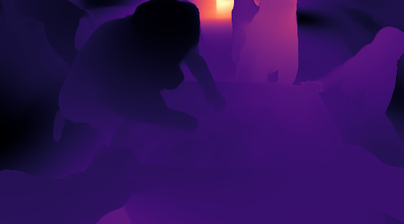
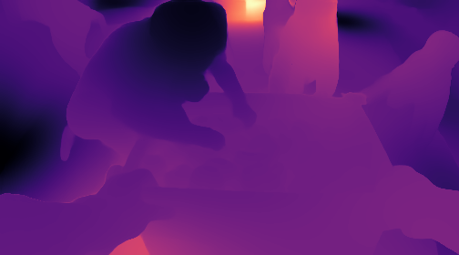
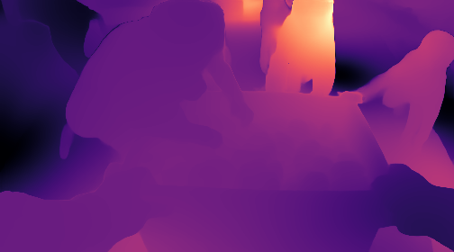
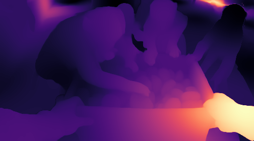
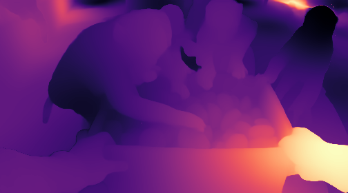
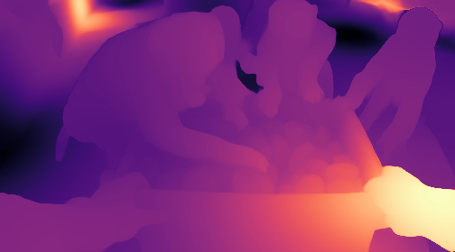

# ADRiver-4D: Interpretable 4D Encoding with Advection–Diffusion–Reaction (ADR) Dynamics

ADRiver-4D performs interpretable encoding of dynamic (4D) point cloud sequences by splitting feature evolution into three explicit mechanisms. 

**Advection (A)** emphasizes **motion-consistent feature transport**: it reweights neighbors using alignment with the predicted scene flow, so features tend to move and mix along coherent motion rather than arbitrary kNN averaging—useful where **structure co-moves** (articulated objects, groups of points sharing a motion pattern) and where **temporal continuity** matters across frames. 

**Diffusion (D)** emphasizes **local spatial regularity** in feature space: a graph Laplacian–style residual (neighborhood mean minus current state), scaled by a learned diffusion coefficient (and uncertainty when available), which **suppresses isolated noise**, **propagates context across nearby points**, and can **stabilize sparse or hole-prone regions** where single-point features are unreliable—situations loosely related to **partial visibility / sampling gaps**.

**Reaction (R)** emphasizes **nonlinear, geometry-aware re-shaping** of features: an MLP acts on the current feature, predicted flow, and **local neighborhood distance statistics (mean/variance)**, so it can amplify **shape discontinuities**, **contact boundaries**, and **rapid local configuration changes** that linear mixing alone would under-express. 

Together, A/D/R expose **which dynamical pathway dominates** (transport vs smoothing vs local nonlinearity) instead of hiding everything in one black-box residual.

| scene rgb | Advection (A) | Diffusion (D) | Reaction (R) |
| :-------: | :-------------: | :-------------: | :------------: |
|  |  |  |  |
|  |  |  |  |

